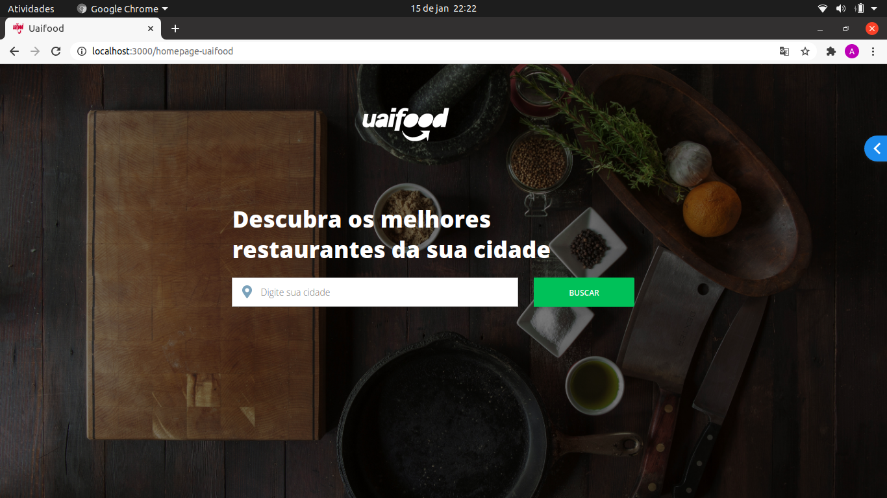
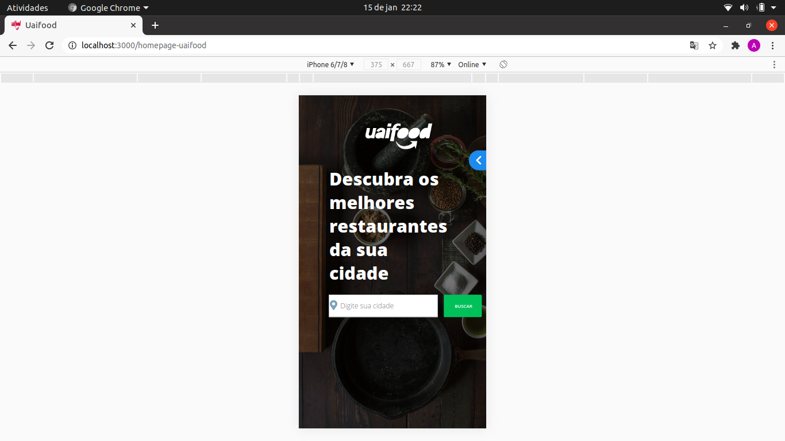
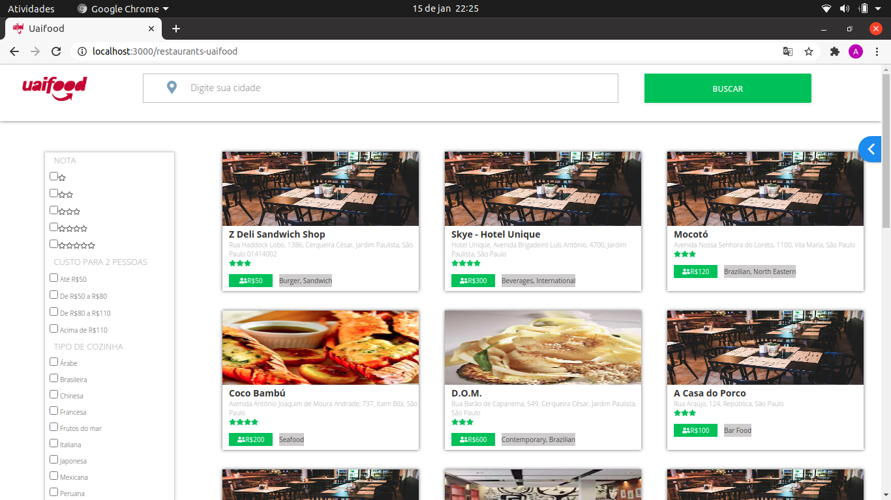
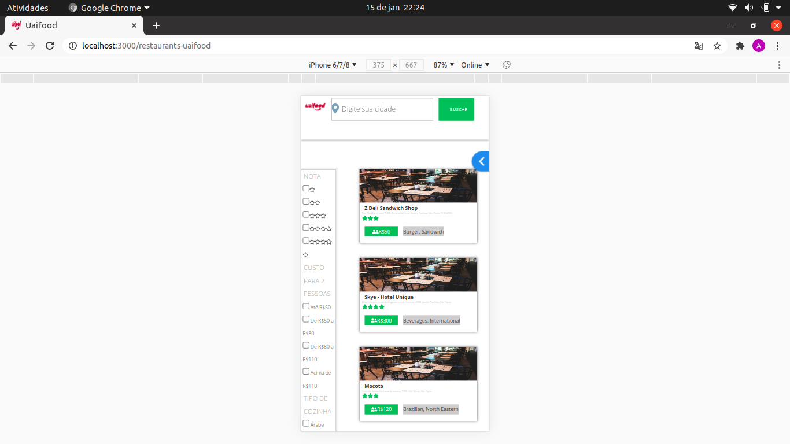

## Descrição do Projeto / Project description

 PT: Criação de uma aplicação que apresenta restaurantes, consumindo API (https://developers.zomato.com/api?lang=pt) 

 EN: Creation of an application that features restaurants, using API (https://developers.zomato.com/api?lang=en) 

### Demonstração/ Demonstration: 
</img>
</img>
</img>
</img>

### Pré-requisitos / Prerequisites (De preferência, testar no chrome / Preferably test on chrome)

 PT: Antes de começar, você vai precisar ter instalado em sua máquina as seguintes ferramentas:
[Git](https://git-scm.com), [Node.js v10.19.0](https://nodejs.org/en/). 
Além disto é bom ter um editor para trabalhar com o código como [VSCode](https://code.visualstudio.com/)  

 EN:Before you begin, you will need to have the following tools installed on your machine:
[Git] (https://git-scm.com), [Node.js v10.19.0] (https://nodejs.org/en/).
In addition, it is good to have an editor to work with the code like [VSCode] (https://code.visualstudio.com/)

# Clone este repositório / Clone this repository
$ git clone <https://github.com/amandahp/teste-uaifood>

# Acesse a pasta do projeto no terminal/cmd / Access the project folder in the  cmd/terminal
$ cd teste-uaifood

# Instale as dependências / Install the dependencies
$ npm install

# Execute a aplicação / Run the application
$ npm start

# Para acessar o código, caso utiliza vscode, execute no terminal / To access the code, if you use vscode, run in the terminal
$ code .